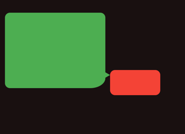
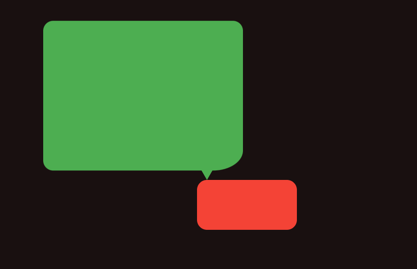
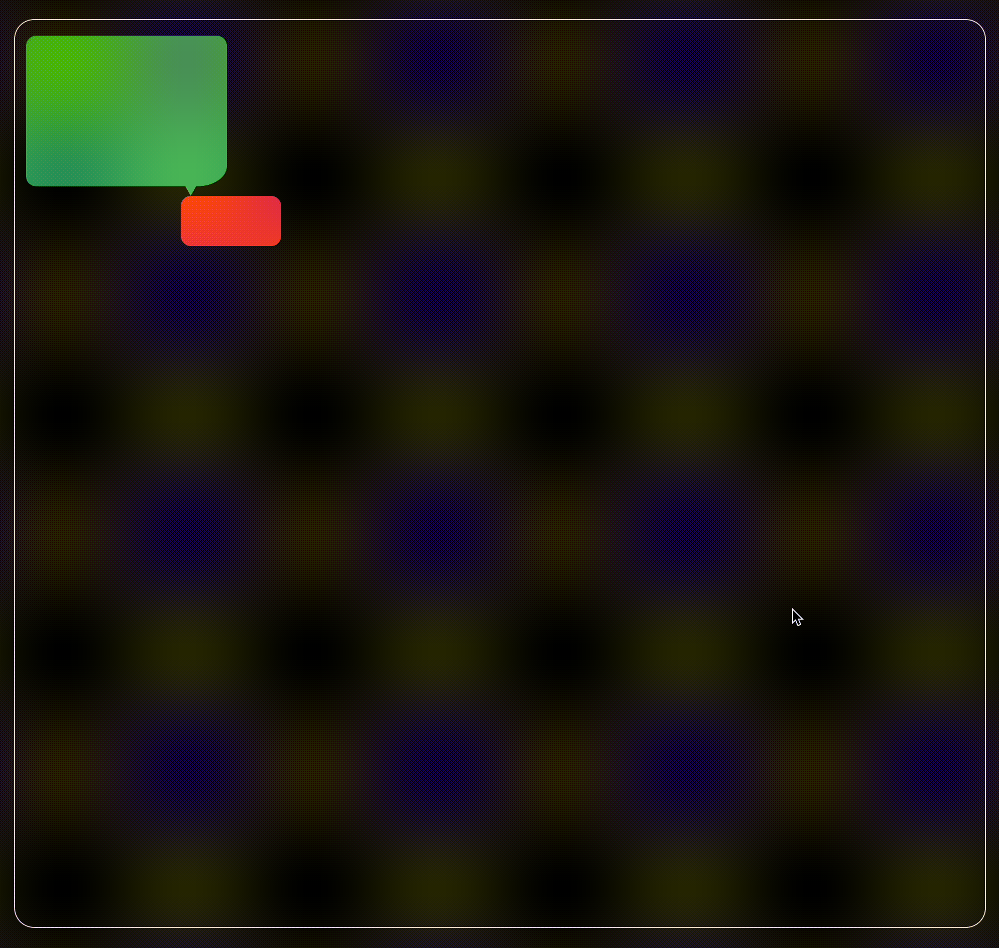
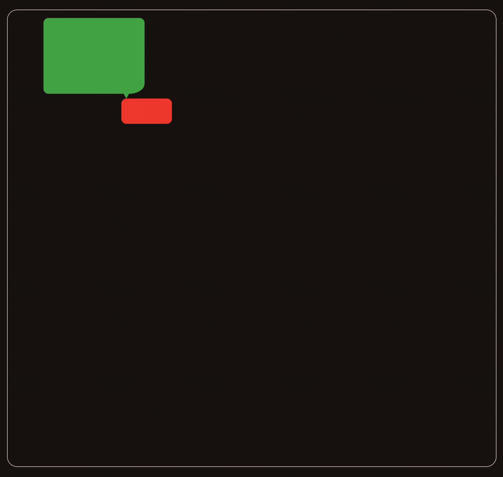

# bubble_pop_up

Easily create highly customizable **bubble pop-ups** anywhere in your Flutter app. Perfect for **tooltips, contextual popups, and interactive UI elements** with flexible positioning and auto-adjustment.

## ✨ Features

- **Attach pop-ups to any widget** – Works anywhere in your app.
- **Customizable positioning** – Control pop-up alignment & arrow direction.
- **Auto border detection** – Adjusts position automatically to avoid overflow.
- **Flexible widget support** – Use any widget inside the pop-up.
- **Lightweight & performant** – No unnecessary dependencies.

## 🚀 Installation

Add `bubble_pop_up` to your `pubspec.yaml`:

```yaml
dependencies:
  bubble_pop_up: latest
```

Then run:

```sh
flutter pub get
```

## 🛠️ Usage

Simply wrap your widget with `BubblePopUp` and specify the **pop-up widget and configuration**.

### Example 1: Right-Aligned Pop-up



```dart
BubblePopUp(
  key: popUpKey,
  config: BubblePopUpConfig(
    baseAnchor: Alignment.topLeft,  // Position of the arrow's POC on the base widget
    popUpAnchor: Alignment.bottomRight,  // Position of the arrow on the pop-up widget
    arrowDirection: ArrowDirection.right,
    popUpBorderRadius: popUpBorderRadius,  // Border radius of the pop-up
    baseBorderRadius: BorderRadius.circular(10),  // Border radius of the base widget
  ),
  popUpColor: Colors.green,
  popUp: Container(
    width: 200,
    height: 150,
    decoration: BoxDecoration(
      color: Colors.green,
      borderRadius: popUpBorderRadius,
    ),
  ),
  child: Container( // Base widget
    width: 100,
    height: 50,
    decoration: BoxDecoration(
      color: Colors.red,
      borderRadius: BorderRadius.circular(10),
    ),
  ),
);
```

### Example 2: Downward Pop-up



The only difference from **Example 1** is the `arrowDirection` parameter:

```dart
arrowDirection: ArrowDirection.down,
```

## 🎨 Customization

You can fully customize the **position, appearance, and behavior** of the pop-up using `BubblePopUpConfig`.

```dart
BubblePopUpConfig(
  baseAnchor: Alignment.bottomCenter,   // Position of the arrow's POC on the base widget
  popUpAnchor: Alignment.topCenter,    // Position of the arrow on the pop-up widget
  arrowDirection: ArrowDirection.up,   // Direction of the arrow
  arrowCornerRadius: 4,                // Adds a corner radius to the arrow
  popUpBorderRadius: BorderRadius.circular(12),  // Border radius of the pop-up
  baseBorderRadius: BorderRadius.circular(12),  // Border radius of the base widget
);
```

### 🔄 Auto Border Detection
The package automatically adjusts the pop-up’s position if it would overflow the screen.

| Same Axis Collision | Cross Axis Collision |
|---------------------|----------------------|
|  |  |

## 📌 Example Scenarios

1. **Tooltips** – Provide hints or explanations.
2. **Dropdown-style menus** – Display interactive options.
3. **Chat bubbles** – Create a message-like pop-up effect.

## 📢 Request Features or Report Issues

Want a new feature or found a bug? **Create an issue here:**  
➡️ [GitHub Issues](https://github.com/vishnuagbly/bubble_pop_up/issues)

## 📝 License

`bubble_pop_up` is open-source and available under the MIT license.

---

🚀 **Enhance your Flutter app with beautiful pop-ups today!**

